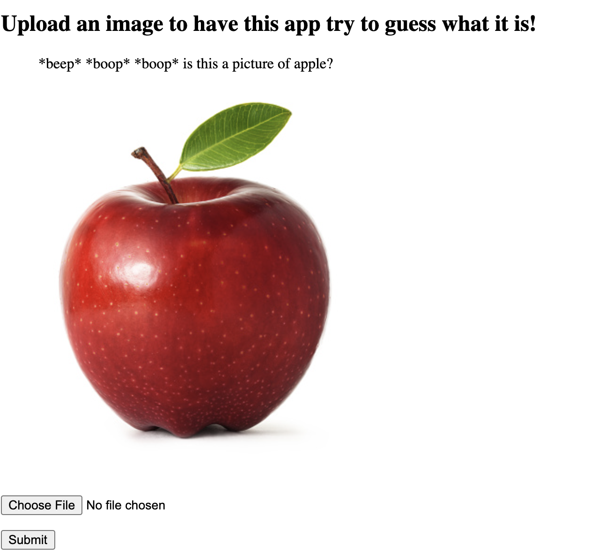

# Image Classification Flask App

## About 

This repository is a simple flask app which runs a custom ResNet neural network trained on the CIFAR100 dataset. Given an input image, this application returns one of CIFAR's 100 image classifications.



## Run Docker
```
>>> docker build -t image-class:latest .
>>> docker run -p 8080:8080 image-class:latest
```

## Run locally

```
>>> python3 -m venv .venv
>>> source .venv/bin/activate
>>> pip install -r requirements.txt
>>> python image_classification_flask_app/main.py
```

#### Credit
The training and model designed was largely built from [this excellent jovian.ai tutorial](https://blog.jovian.ai/image-classification-of-cifar100-dataset-using-pytorch-8b7145242df1) by user @Hurly119.
App design is from a simple flask template by [@roytuts.
](https://github.com/roytuts/flask/tree/master/python-flask-upload-display-image)
